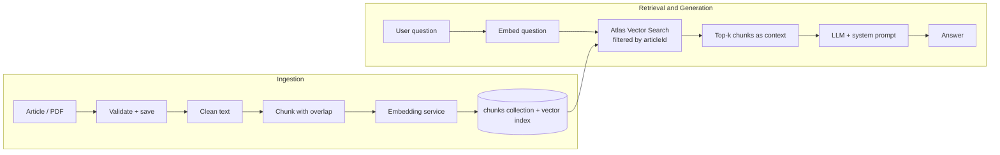

# MERN AI Integration Patterns

AI features for a MERN app, built one Git branch at a time:
**semantic search → RAG → document RAG → conversational RAG → tool calling → agent.**

Each branch adds exactly one capability on top of the previous one, so you can read the diff and see what that layer actually requires in production. Every layer was designed on paper first and built from official documentation.

---

## Why this repo exists

Most AI demos stop at "the model answered my question." Production starts after that: retrieval quality, noisy documents, prompt contracts, follow-up questions, and tool selection all decide whether an AI feature is reliable.

This repo isolates each of those layers in its own branch so they can be studied, debugged, and evaluated one at a time.

---

## Architecture



### A. Ingestion pipeline

1. The user submits an article (about 500 words) or uploads a PDF.
2. The route validates the input and saves the article in the `articles` collection to generate an `articleId`.
3. The text and `articleId` go to the Chunking Service, which cleans the text and splits it into slightly overlapping chunks.
4. The chunks go to the Embedding Service, which returns objects of the form:
   ```js
   { articleId, chunkIndex, chunkText, embedding }
   ```
5. These documents are saved in the `chunks` collection with a reference to the original article.
6. The API confirms the article is indexed and ready for RAG-based search.

### B. Retrieval and generation pipeline

1. The user sends a question along with the `articleId`.
2. The Embedding Service generates an embedding for the question.
3. Atlas Vector Search runs a semantic search **only within chunks of that article**.
4. The most relevant chunks are retrieved with similarity scores.
5. The chunks are combined into the context.
6. The LLM receives the question, the context, and an instruction to answer only from the supplied context.
7. The generated answer is returned to the user.

---

## Branch map

Read the branches in order. Tool calling comes before agents on purpose.

| Branch | Capability | Core idea | MERN analogy | Read this for |
|---|---|---|---|---|
| `baseline` | Starting point | Standard MERN app | n/a | The "before" snapshot |
| `rag-ingestion` | Embeddings + vector storage | Text becomes searchable vectors | Write path with an index | Chunking, overlap, embedding model |
| `rag-retrieval` | Semantic search + generation | Retrieve by meaning, then generate | Query, then render | Filtered vector search, system prompt |
| `rag-file-upload` | Document RAG | PDF → clean → chunk → index | File upload + processing pipeline | Noise cleaning, chunk size |
| `conversation-rag` | Conversational RAG | History-aware retrieval | Session state | Message storage, standalone query rewriting |
| `tool-calling` | Tool calling | LLM chooses a function | Router dispatching handlers | Tool descriptions as the contract |
| `agent-branch` | Agent | Tool calling in a loop | Middleware chain with a decision step | Loop control, stop conditions |

---

## Key engineering decisions

### Embedding model is a measured decision

The first embedding model (`nomic-embed-text`) gave weak retrieval on my test queries. After switching to a Qwen embedding model (`[exact model name]`), retrieval quality improved clearly.

| Model | Test queries | Correct chunk in top 3 |
|---|---|---|
| `nomic-embed-text` | `[N]` | `[X/N]` |
| `[Qwen embedding model]` | `[N]` | `[Y/N]` |

Changing the model means re-embedding the whole collection and updating the vector dimensions in the index definition.

### Ingestion quality decides retrieval quality

PDFs are noisy. Cleaning is a pipeline stage that runs before chunking, not a one-off script. It removes:

- repeated headers and footers
- page numbers
- broken hyphenation and stray line breaks
- extra whitespace and table fragments

Chunking trade-off: small chunks retrieve precisely but lose context; large chunks keep context but dilute relevance. Current setting: `[chunk size]` characters with `[overlap]` overlap.

### Retrieval is scoped

Vector search is filtered by `articleId`, so answers come only from the document the user asked about. The filter field must be declared in the Atlas vector index definition.

### The system prompt is the contract between retrieval and generation

The RAG prompt instructs the model to:

- answer only from the supplied context
- say "I don't know" when the context does not contain the answer
- reference the source chunk

This is where hallucination control lives.

### Conversation memory

Chat history is stored as `HumanMessage`, `AIMessage`, and `SystemMessage` objects, because that is the structure the LLM expects on every call.

Follow-ups such as "what about their pricing?" retrieve nothing useful on their own. Before retrieval, the follow-up is rewritten into a standalone question using the chat history.

### Tool calling first, agents second

Tool calling is the LLM's decision layer: given a query, it picks the right tool. An agent is that decision made repeatedly in a loop. Tool descriptions act as the API contract the model reads, so vague descriptions cause wrong tool choices.

---

## What broke and how it was fixed

| Problem | Where | Fix |
|---|---|---|
| Low retrieval accuracy | `rag-ingestion`, `rag-retrieval` | Compared embedding models on a fixed query set and switched |
| Noisy PDF text polluting chunks | `rag-file-upload` | Regex-based cleaning stage before chunking |
| Follow-up questions retrieved nothing | `conversation-rag` | Standalone query rewriting from chat history |
| `[add one more real failure]` | `[branch]` | `[fix]` |

---

## Evaluation

A small test set of `[N]` queries with known correct chunks, used to compare embedding models and chunking settings. Results: `[link or table]`.

---

## Run locally

```bash
git clone https://github.com/rajeshThappeta/ai-integration-demo
cd ai-integration-demo
git checkout rag-retrieval    # or any branch from the map above
npm install
cp .env.example .env          # add your keys
npm run dev
```

**Requirements:** Node `[version]`, MongoDB Atlas with a vector search index, `[LLM provider]` API key, and access to the embedding model you choose.

Each branch has its own setup notes if it needs anything extra.

---

## Stack

Node.js · Express · MongoDB Atlas Vector Search · React · `[LangChain JS / provider SDK]` · `[models used]`

---

## Roadmap

- Evaluation harness for retrieval quality
- Observability for LLM calls (latency, cost, traces)
- Deployment guide

---

## Author

**Rajesh T**, AI Engineering Educator, Hyderabad
[rajesh-t.dev](https://www.rajesh-t.dev) · [LinkedIn](https://www.linkedin.com/in/rajesh-t)
