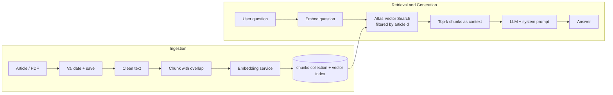

# MERN AI Integration Patterns

AI features for a MERN app, built one Git branch at a time:
semantic search → RAG → document RAG → conversational RAG → tool calling → agent.

Each branch adds exactly one capability, so you can read the diff and see
what that layer actually requires. Built from official documentation and
designed on paper before coding.

## Architecture



## Branch map

| Branch | Capability | Core idea | MERN analogy | Read this for |
|---|---|---|---|---|
| `[branch-1]` | Semantic search | Meaning-based lookup via embeddings | Indexed query, matched by similarity | Embedding model comparison |
| `[branch-2]` | LLM integration | Prompt in, completion out | Calling a third-party REST API | Prompt structure |
| `[branch-3]` | Vector database | Storing and querying vectors | Collection + index | Index definition, filters |
| `[branch-4]` | RAG | Retrieve, then generate | Query, then render | Context assembly |
| `[branch-5]` | Document RAG | PDF ingestion pipeline | File upload + processing | Cleaning, chunking |
| `[branch-6]` | Conversational RAG | History-aware retrieval | Session state | Standalone query rewriting |
| `[branch-7]` | Tool calling | LLM chooses a function | Router dispatching handlers | Tool descriptions |
| `[branch-8]` | Agent | Tool calling in a loop | Middleware chain with a decision | Loop control, stop conditions |

Suggested reading order: top to bottom. Tool calling comes before agents on purpose.

## Key decisions

**Embedding model.** Compared `[model A]` and `[model B]` on `[N]` test queries.
Correct chunk in top 3: `[X/N]` vs `[Y/N]`. Changing models means re-embedding
the collection and updating the vector index dimensions.

**Chunking.** `[size]` characters with `[overlap]` overlap. Small chunks retrieve
precisely but lose context; large chunks keep context but dilute relevance.

**Retrieval scope.** Vector search is filtered by `articleId`, so answers come only
from the document the user asked about. The filter field must be declared in the
Atlas vector index definition.

**System prompt.** Answer only from the supplied context, say "I don't know" when
the context lacks the answer, and cite the source chunk.

**Conversation memory.** History is stored as Human / AI / System messages.
Follow-ups like "what about their pricing?" are rewritten into standalone
questions using history before retrieval.

## What broke and how it was fixed

- PDF noise (headers, footers, page numbers, broken lines) hurt retrieval → cleaning pipeline stage before chunking
- `[add 1-2 more real failures]`

## Evaluation

`[N]` test queries with known correct chunks. Results per branch/model in `[link or table]`.

## Run locally

```bash
git clone https://github.com/rajeshThappeta/[repo-name]
cd [repo-name]
git checkout [branch]
npm install
cp .env.example .env   # add your keys
npm run dev
```

Requires: Node `[version]`, MongoDB Atlas with a vector index, `[LLM provider]` API key.

## Stack

Node.js · Express · MongoDB Atlas Vector Search · React · `[LangChain JS / provider SDK]` · `[models used]`

## Next

Evaluation harness · observability · deployment

## Author

Rajesh T, AI Engineering Educator, Hyderabad · [rajesh-t.dev](https://www.rajesh-t.dev) · [LinkedIn](https://www.linkedin.com/in/rajesh-t)
